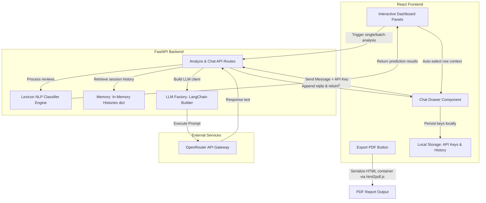

# AI Agent Replication & Integration Prompt - Generic Dashboards, Visualizations, and Contextual Chatbots

This document serves as a master blueprint and copy-paste prompt to copy-paste into *any* AI coding assistant (chatbot) when starting a new project that requires **interactive data dashboards (charts)**, **PDF reporting**, and a **context-aware chatbot agent**.

---

## Part 1: The Copier/Replicator Prompt
*Copy and paste the prompt block below into the chat when initializing a new project.*

```markdown
I need you to build a premium interactive dashboard with advanced data visualizations, client-side PDF exporting, and a contextual AI chatbot drawer. Please replicate the architecture and patterns below.

### 1. Interactive Visualizations & Design Direction
We want a dashboard that supports high-fidelity charts. When building or proposing updates, do not just install libraries blindly. Suggest and ask me before making changes (e.g. "Do you want me to add a stacked bar chart or a horizontal bar graph?").
Please design and prepare the following chart options:
*   **Radar spiderweb chart**: For multi-dimensional scores (e.g., breakdown of different category attributes, emotions, or metrics).
*   **Vertical & Horizontal bar graphs**: For distribution frequency of categories and items.
*   **Stacked bar charts / Stacked paragraphs**: For tracking compound segments within a category.
*   **Line chart / Timeline**: For mapping numerical scores or performance progression over time/indexes.
Ensure all visual panels follow a high-end, responsive design system matching the main theme colors and use a library like Recharts or Chart.js wrapped inside clean card layouts.

### 2. Client-Side PDF Exporting
*   Implement a direct client-side "Export PDF" button.
*   Use a client-side wrapper like `html2pdf.js` to serialize the target dashboard wrapper element.
*   Render options must be optimized for crisp output (e.g., scale: 2, useCORS: true, letter size format) so that all rendering charts print cleanly without clipping.

### 3. Multi-Provider LLM Chatbot Drawer (Bring Your Own Key)
*   **Settings Panel:** Create a sliding drawer component (`ChatDrawer`) containing a collapsible settings section. The settings section must let the user configure their own API Key, select the Provider, and select the Model.
*   **OpenRouter Free Router Option:** The UI must list OpenRouter as a primary provider, defaulting to free options (e.g. `openrouter/free`, `google/gemma-4-31b-it:free`, `meta-llama/llama-3.3-70b-instruct:free`, `qwen/qwen3-coder:free`) to keep it zero-cost.
*   **Backend Factory:** The backend must expose a chat routing handler that instantiates the LLM using a factory function (e.g. `get_llm(provider, api_key, model)`). It must not hardcode keys, but dynamically build client interfaces based on the client request header/payload.

### 4. Memory & Session Management
*   Group conversation history by a unique `session_id` generated on the client side.
*   Use an in-memory session dictionary in the backend (`chat_histories = {}`) to store lists of past messages (Human, AI, System). Do not use external database configurations unless explicitly instructed.
*   Implement a cleanup endpoint (e.g., `DELETE /api/chat/{session_id}`) to clear histories when context changes or resets.

### 5. Automatic Context Injection (Connect Predictions to Chat)
*   When a data row or analysis prediction is selected on the frontend dashboard, update the chatbot context.
*   The client must send this prediction context to the backend when starting chat sessions.
*   Inject the active context directly into the agent's **System Prompt** so the chatbot is instantly aware of "this item/this row/the current prediction" and greets the user with an intelligent breakdown.

### 6. Domain Guardrails & Contextual Knowledge
The chatbot must remain locked to the project domain, but must NOT be overly restrictive:
*   **Guardrails:** Refuse to answer questions completely unrelated to the application's domain (e.g. medical advice, politics).
*   **Contextual Knowledge:** Allow the AI to answer general questions about the *specific products or topics* identified in the context (e.g. specifications, brand reputation, economics, or alternatives).

### 7. Business Decisioning & Action Directives
The system prompt must include these 11 core instructions for business recommendations:
1.  **Product Detection & Clarification:** Predict what product/category the customer is talking about. If it is ambiguous, ask the user to clarify before suggesting solutions.
2.  **Actionable Business Recommendations:** Propose clear strategic options (e.g. product fixes, marketing updates, pricing tweaks).
3.  **Keep vs. Cut Decision Matrix:** Recommend whether the business should keep (invest in fixing) or cut (discontinue) a product line based on sentiment severity.
4.  **Iterative Quality Improvement:** Offer concrete design adjustments for specific flaws mentioned in the reviews (e.g., battery life, screen quality).
5.  **Mitigation via Financial Incentives:** Suggest pricing changes (discounts, bundle offers) to make products more accessible and offset minor downsides.
6.  **Value Proposition Optimization:** Advise how to restructure marketing to emphasize key strengths to overlook downsides.
7.  **Customer Support Interventions:** Suggest customer support recovery plans (replacements, extended warranties).
8.  **Supply Chain Modifications:** Recommend availability adjustments if reviews indicate shipping or stock problems.
9.  **Universal Category Applicability:** Apply strategies broadly to any product class (home goods, clothing, etc.), not just electronics.
10. **Competitor Benchmarking:** Study how competitors resolved similar design challenges.
11. **Strategic Pivot Suggestions:** Pivot/rebrand the product around its most liked secondary feature if the core feature is widely disliked.

### 8. UI/UX Chat Bubbles & Thread-Safe Typewriter Rendering
*   **Thread-Safe Typewriter:** Do NOT use `setInterval` with local variables (`let index = 0`) in `useEffect` to type text. React Strict Mode triggers double-mounts which cause concurrent interval loops to interleave writing, leading to corrupted text (dropped/mutated letters). Implement the typewriter by incrementing a state length counter and rendering `text.slice(0, currentLength)`, driving it with a `setTimeout` loop that gets cleared on dependency updates.
*   **Newline Formatting:** All message containers in the chat drawer must use the Tailwind CSS class `whitespace-pre-wrap` (or style `white-space: pre-wrap`). This prevents newlines, paragraphs, and list margins returned by the LLM from collapsing into a single, jumbled text block, ensuring readability.
```

---

## Part 2: Architectural Integration & Flow
Here is the architectural layout showing how the Frontend, Backend, and Generative AI Chatbot sections connect to power these premium features.

### Diagram: Flow of Context and PDF Export


### 1. Connection Specifics
*   **Analysis Flow:** The frontend sends text data to `/api/analyze/single` or `/api/analyze/batch/ws` (WebSocket). The backend runs the deterministic rules classifier and returns raw prediction schemas.
*   **Context Syncing:** The frontend tracks `selectedResult`. When this result changes, it triggers an effect that sets a new welcome message in the chatbot and prepares a localized context block.
*   **Chat Execution:** The user sends a chat message. The request contains:
    1.  `session_id` (persisted client-side string)
    2.  `message` (user input)
    3.  `provider`, `model`, `api_key` (from `ChatDrawer` state)
    4.  `review_context` (compiled details of the active selected data row)
*   **LangChain Factory:** The backend reads the provider details, dynamically creates an instance of the provider's LLM model using the client's API key, loads the session history list, prepends the System Prompt containing the contextual data block, and executes the conversation chain.
*   **PDF Export Hook:** The `html2pdf.js` library targets the dashboard element `id="analysis-report"`. When the button is clicked, it prints the DOM container (which includes all active Recharts panels) directly into a client-generated PDF file.
